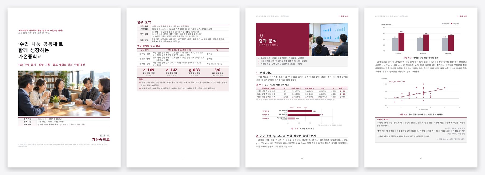
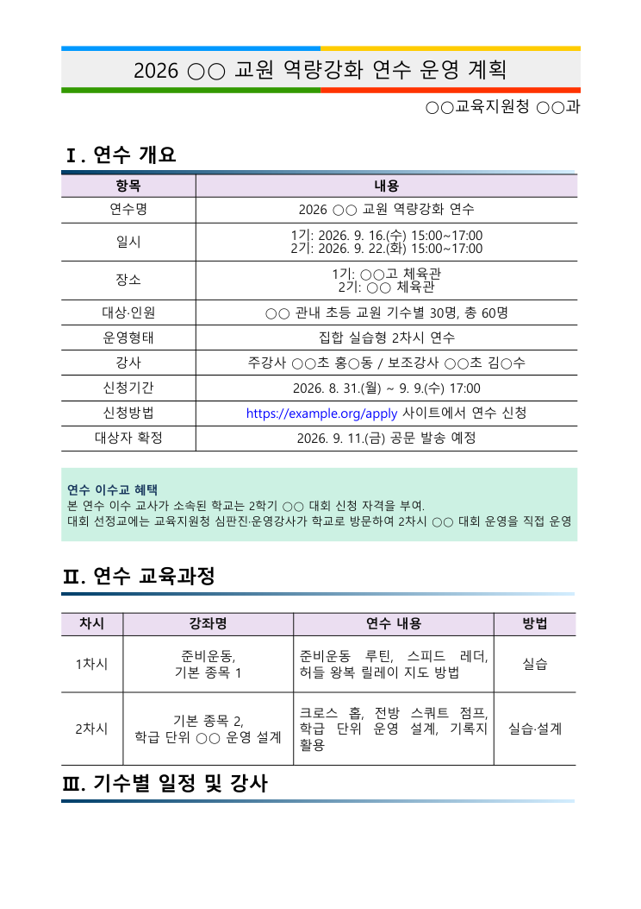
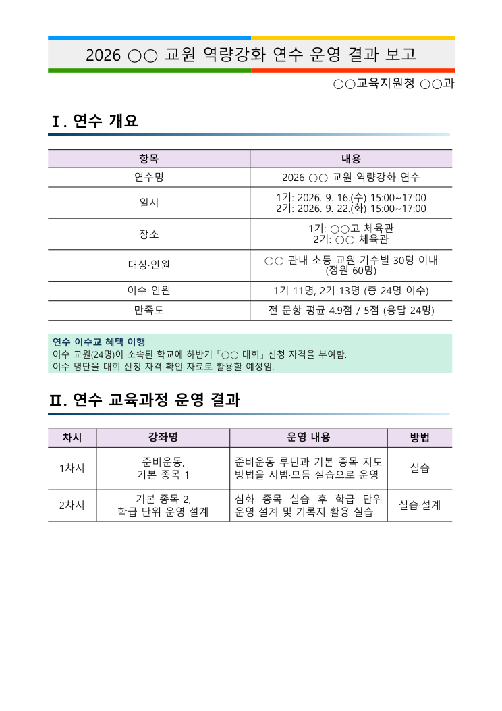
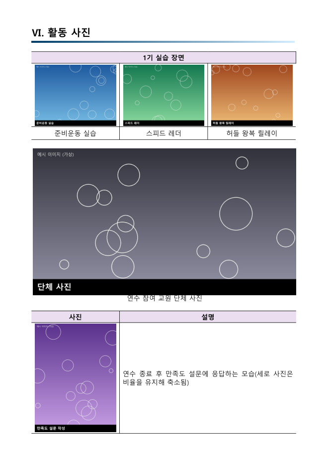

# hwpx_new

[](https://github.com/ZZombie04/hwpx_new/releases)
[](https://www.python.org/)
[](LICENSE)
[](docs/clients.md)
[](https://zzombie04.github.io/hwpx_new/)

**한글(HWPX) 문서를 AI 로 만드는 도구입니다.** 서식 파일을 주면 그 서식 그대로 새 문서를, 서식이 없으면 **차례·통계·도표까지 맞춰진 연구학교 결과보고서**를 `HWPX` 와 `PDF` 로 만들어 줍니다.

> "이 계획서를 결과보고서로 바꿔줘" · "작년 안내문을 올해로 고쳐줘" · "겉공문 만들어줘" · "**연구학교 결과보고서 써줘, 설문 자료는 data.csv**"

Claude · ChatGPT(Codex) · Gemini · Grok · Cursor · Antigravity 등 **어떤 AI 에서도** 같은 결과가 나오도록 만든 스킬 + MCP + 명령줄 도구입니다. 소개 페이지: **https://zzombie04.github.io/hwpx_new/**



| 서식(계획서) | → | 결과(결과보고서) |
|:-:|:-:|:-:|
|  | |  |

표지 띠, 소제목 바, 표 색·테두리, 강조 박스, 글머리 기호, 글자 색·굵기, 줄 간격, 쪽 번호까지 **원본 서식 그대로** 복제됩니다.

## 새 기능 2.3.0 — 연구학교 결과보고서·연구보고서를 원고 한 장으로

```bash
hwpx-new report init 내보고서                 # 바로 빌드되는 예시 원고 + 자료(CSV) + 사진
hwpx-new report 내보고서/report.txt           # → 내보고서/결과/이름.hwpx + .pdf + 점검 결과
```

| 도구가 알아서 | 내용 |
|---|---|
| **차례·표 차례 실제 쪽수** | 한글로 PDF 를 만들어 제목이 놓인 쪽을 읽고, 쪽이 바뀌지 않을 때까지 다시 조판(보통 2번) |
| **표·그림 번호와 참조** | `{표:키}` → '표 Ⅴ-3', 번호 뒤 조사(과/와, 을/를)도 받침에 맞게 |
| **통계는 계산 명령으로** | `@stats paired data.csv --pre 사전 --post 사후` → t·p·d·95% CI·α·κ·r 을 조판할 때마다 자료에서 다시 계산(외부 패키지 없이, scipy 와 소수점 13자리까지 일치) |
| **도표 12종** | 막대·묶음·효과 크기·산점도·누적·흐름·절차·순환… 자료만 쓰거나 `data=자료.csv` 로 파일에서 바로. 인쇄해도 읽히는 글자, 300dpi |
| **긴 표** | 쪽을 넘으면 행 단위로 나누고 머리행 반복, 표 제목만 쪽 끝에 남으면 다음 쪽으로 |
| **조판 다듬기** | `t(31) = 6.16`·`p < .001` 같은 통계 표현이 줄 끝에서 갈라지지 않게, 한 장짜리 사진은 틀을 사진에 맞춰 가운데로 |
| **심사 전 점검** | 참고문헌에 없는 인용, 틀린 요일, 풀리지 않은 참조, 근거보다 큰 말('입증'), 검정 없는 '유의', 쪽수 초과 |

예시는 가상 학교 ‘가온중학교’의 20쪽 보고서입니다(수치는 예시 자료, 사진은 생성형 AI 예시). 원고 문법은 [hwpx_new/REPORT.md](hwpx_new/REPORT.md) (`hwpx-new report guide`).

---

## 핵심 아이디어: "서식은 도구가, 글은 AI 가"

서식의 모양(글자 색·크기·굵기, 줄 간격, 들여쓰기, 글머리 기호, 표 테두리·칸 색, 간격)을 AI 가 흉내 내면 AI 마다 결과가 달라집니다.
그래서 `hwpx_new` 는 **서식 안의 실제 요소를 그대로 복제**하고 AI 는 **글과 구조만** 씁니다.

1. `hwpx-new analyze 서식.hwpx` — 서식을 분석해 **같은 모양끼리 묶은 "서식 종류"**(`H1` 소제목, `B1` 글머리, `T2` 표 …)와, 서식을 **그대로 다시 만들어 내는 뼈대 Markdown** 을 줍니다.
2. AI 는 뼈대의 글만 새 목적에 맞게 고치고 구조를 재구성합니다(표시 `{B2}` 는 그대로 둠).
3. `hwpx-new build` — 원본 요소를 복제해 HWPX 를 만들고, **한글로 PDF 를 만들어 쪽 배치를 점검·자동 보정**합니다.

실제 공문서·계획서 54종으로 "서식 → 뼈대 → 재조립 → 원본과 비교"를 돌리면 블록의 **약 87%** 가 글자 크기·색·굵기·정렬·들여쓰기·줄간격·테두리까지 원본과 같은 모양으로 재현됩니다
(`hwpx-new selfcheck 서식.hwpx` 로 내 서식의 재현도를 직접 볼 수 있습니다. 사진·도면·병합 표 같은 복잡한 블록은 통째로 복제하므로 모양 100%).

## 설치 (5분, git 불필요)

1. **Python 3.9 이상** 설치 (Windows: `winget install -e --id Python.Python.3.12`, 또는 python.org — *Add python.exe to PATH* 체크)
2. 아래 중 하나
   - **ZIP 으로**: GitHub 의 *Code → Download ZIP* → 압축 풀기 → Windows 는 `install.bat` 더블클릭 / macOS·Linux 는 `bash install.sh`
   - **한 줄로** (git 없이도 됨):
     ```bash
     pip install https://github.com/ZZombie04/hwpx_new/archive/refs/heads/main.zip
     ```
   - git 이 있으면: `pip install git+https://github.com/ZZombie04/hwpx_new.git`
3. 확인 및 AI 프로그램 연결
   ```bash
   hwpx-new doctor      # 환경 점검
   hwpx-new setup       # 설치된 AI 프로그램(Claude·Codex·Gemini·Cursor…)에 MCP 자동 연결
   ```
   `install.bat` / `install.sh` 는 전용 가상환경에 설치하고 위 두 단계까지 자동으로 해 줍니다. `hwpx-new` 명령이 안 잡히면 `python -m hwpx_new …` 로 쓰면 됩니다.

> 필요한 패키지는 `lxml`, `pymupdf`, `pillow`, `segno`(QR) 네 개뿐입니다(MCP 서버·통계·점검기는 표준 라이브러리만으로 구현).
> **한글(Hancom Office)이 설치된 Windows** 에서는 실제 한글로 PDF 를 만들어 쪽 배치가 가장 정확합니다.
> 한글이 없으면 Chrome/Edge 기반 내장 렌더러가 **근사 PDF** 를 만듭니다(HWPX 자체는 동일).

## AI 에 연결하기

| 방법 | 대상 | 하는 일 |
|---|---|---|
| **A. 명령줄 AI** | Claude Code · Codex · Gemini CLI · Grok · Antigravity … | 이 폴더를 열고 말하면 됩니다. 저장소의 `AGENTS.md`(= `CLAUDE.md`, `GEMINI.md`)에 작업 절차 전체가 있어 AI 가 스스로 분석 → 작성 → 변환 → 확인 → 보정까지 합니다 |
| **B. MCP** | Claude Desktop/Code · Cursor · Windsurf · Codex · Gemini … | `hwpx-new setup` (자동) 또는 `hwpx-new mcp-config` (출력된 설정을 붙여 넣기). `hwpx_analyze` · `hwpx_build` · `hwpx_preview` 등 도구가 생깁니다 → [docs/clients.md](docs/clients.md) |
| **C. Claude 스킬** | Claude Code | `hwpx-new setup --skill` |
| **D. 도구 연결 없는 채팅 AI** | 웹 ChatGPT · Gemini · Grok | `hwpx-new prompt 서식.hwpx "요청"` 출력 전체를 채팅창에 붙여넣고, AI 가 준 Markdown 을 `content.md` 로 저장해 `hwpx-new build 서식.hwpx content.md -o 결과` |
| **E. 채팅 AI 로 장편 보고서** | 웹 ChatGPT · Gemini · Claude · Grok | `hwpx-new report prompt "요청" --data 자료.csv -o 프롬프트.txt` → 붙여 넣기 → 받은 원고를 `report.txt` 로 저장 → `hwpx-new report report.txt` |

```
서식.hwpx 를 분석해서 결과보고서로 만들어줘. 연수는 9/16, 9/22 두 번 했고 각각 11명, 13명 이수했어.
```

## 이렇게 말하세요 (예시)

| 하고 싶은 일 | AI 에게 |
|---|---|
| 계획서 → 결과보고서 | "`계획서.hwpx` 를 결과보고서로 만들어줘. 참석 24명, 만족도는 매우 좋았어" |
| 작년 문서 → 올해 | "작년 `안내문.hwpx` 를 올해(2026년 10월 14일 수요일) 행사로 바꿔줘" |
| 같은 양식으로 새 문서 | "이 `양식.hwpx` 로 ○○ 사업 운영 계획서 만들어줘. 자료는 아래와 같아…" |
| 사진·도면이 많은 기존 문서를 우리 기관용으로 | "`도교육청 요강.hwpx` 를 읽고 우리 지역 조건(참가 대상·신청 방법·시상)을 넣어 운영 계획서를 만들어줘" (원본 사진·표·양식은 그대로 복제) |
| 옛 `.hwp` 파일 | "`서식.hwp` 로 …" (Windows+한글이면 자동 변환) |

AI 는 마지막에 **HWPX 경로, PDF 경로, (지어낸 내용이 있다면) 그 목록**을 알려 줍니다. 사용자가 주지 않은 숫자·이름을 임의로 만들지 않는다는 규칙이 지침에 들어 있습니다.
빌드는 **서식 원문의 문장이 그대로 남았는지**(옛 기관명·날짜), 날짜-요일 불일치, 표 칸 수 불일치도 경고합니다.

## 사진도 알아서 넣어 줍니다

```
서식(계획서).hwpx 로 결과보고서 만들어줘. 사진은 사진/ 폴더에 있어. 1기는 9/16, 11명 이수.
```

1. `hwpx-new photos 사진/` — 촬영 시각 순 목록과 **번호 붙은 한눈에 보기 이미지**. AI 가 이 이미지를 보고 각 사진이 무엇인지 파악합니다.
2. 활동 장면은 **사진 대지**(표 안의 사진 격자 + 캡션), 단체 사진은 **단독 사진**, 설문지·자료는 **표 셀 안**에 넣습니다.
3. 사진은 자동으로 **회전 보정 · 형식 변환(HEIC 등) · 용량 줄이기** 후 HWPX 안에 들어갑니다.
   - 원본을 그대로 넣지 않고 **문서에 보이는 크기 × 200dpi**(인쇄해도 깨끗한 해상도)로 줄입니다. 키우지는 않습니다.
   - 사진은 JPEG(품질 82), 도표·QR 같은 그림은 색 수에 맞춘 PNG — 휴대전화 사진 한 장(3~5MB)이 보통 100~300KB 가 됩니다.
   - 이미 원본 사진이 잔뜩 들어간 문서는 `hwpx-new shrink 문서.hwpx -o 작은문서.hwpx` 로 그림만 줄입니다(글·서식은 그대로, 원본 파일은 그대로 둠).



## 산만한 서식을 깔끔하게 — 정돈 조판(compose)

서식 원본의 글자색·정렬·번호가 제각각이면, 그대로 복제하는 대신 **본문을 하나의 체계로 새로 짭니다**(표지·대제목 디자인만 서식에서 가져옴).

- 체계: **Ⅰ(대제목) → ■ 소제목 → ❍ 항목 → - 세부 → ※ 참고** — 단계마다 글꼴·크기·들여쓰기·줄간격 고정, 둘째 줄은 기호 뒤 글자에 정확히 맞춤
- 글자색은 검정, 꼭 지킬 기한만 강조색 / 표는 머리행 연한 남색·항목 열 연회색·위아래 굵은 선으로 통일
- 명세(JSON): `hwpx-new compose 명세.json -o 결과.hwpx --check` (예시 `examples/compose_spec.json`), 파이썬 API 는 `hwpx_new.compose.Composer`
- 만든 뒤 `hwpx-new qa 결과.pdf` 로 정렬·색·겹침을 자동 점검합니다.

## 어떤 AI 모델로 해도 같은 결과가 나오게

모양을 AI 가 파이썬으로 직접 짜면 모델마다 결과가 달라집니다(강한 모델은 잘 짜고, 가벼운 모델은 들여쓰기·표·결재란을 놓침).
그래서 2.2.0 부터는 **모양은 도구가, AI 는 JSON 명세(글과 구조)만** 씁니다 — `compose`·`gongmun`·`patch` 명세 → 만들기 → `--check`(오류 0 까지) → 쪽 그림 확인.
지침(`AGENTS.md`)은 '작업 고르기 표 → 공통 순서 체크리스트'로 되어 있어 가벼운 모델도 같은 순서를 따릅니다. 예시 명세: `examples/*.json`.

2.3.0 은 한 걸음 더 갑니다.
- **숫자도 AI 가 만들지 않습니다.** 원고에는 `@stats` 계산 명령만 쓰고 숫자는 도구가 자료에서 계산합니다(가벼운 모델이 t값·p값을 지어내는 일이 없음).
- **도표 코드도 짜지 않습니다.** `@chart` 에 자료만 쓰면 같은 디자인으로 그립니다.
- **바로 고쳐 쓸 완성 예시**(`report init`)가 있어 어떤 모델이든 구성을 그대로 따라 씁니다.
- **원고 실수에도 멈추지 않습니다.** `@end` 빠짐·모르는 표시·칸 수가 틀린 표·없는 사진·없는 열 이름은 도구가 고치거나 표시하고, 점검 결과로 알려 줍니다.
- **실험**: 가장 가벼운 모델(Claude Haiku)에게 지침 파일만 주고 다른 학교·다른 설문 자료로 보고서를 맡겼더니,
  통계 19개를 모두 `@stats` 로 계산해 20쪽(본문 13쪽) 보고서를 **점검 오류 0** 으로 완성했습니다. 이때 나온 헷갈린 점(쪽수 기준·색 규칙·변화량 계산)은 지침과 도구에 반영했습니다.
- **어떤 환경에서도**: MCP 서버·통계·도표·점검기는 표준 라이브러리 + `lxml`·`pymupdf`·`pillow` 만 씁니다(Node·브라우저 자동화 불필요).
  한글이 있으면 한글이 PDF 를 만들고(한글 2024 에서 실측), 없으면 내장 렌더러가 같은 쪽 수의 근사 PDF 를 만듭니다. 콘솔이 CP949 여도 출력이 깨지지 않습니다.

## 한글이 "파일 접근 허용"을 물어볼 때

한글은 외부 프로그램이 파일을 열 때 **"파일 접근 허용" 보안 승인 창**을 띄웁니다. `hwpx_new` 는 **자기가 띄운 한글 프로세스의 창**에서, **자기 작업 폴더 안의 임시 파일**에 대한 요청일 때만 [접근 허용](이번 한 번)을 대신 눌러 줍니다.
누르는 방법은 실제 마우스 클릭(끝나면 마우스 위치 복원) → (창이 안 닫히면) 접근성 호출 → 단축키(Alt+Y) 순서입니다(한글은 접근성 호출을 무시하는 경우가 있어 마우스 클릭이 먼저입니다). [모두 허용]·[허용 안 함]은 누르지 않고, 한글 보안 설정·레지스트리는 바꾸지 않으며, 사용자가 열어 둔 한글 창은 건드리지 않습니다.

- **화면보호기·잠금 상태에서는 자동 클릭이 되지 않습니다.** 이때는 50초 뒤 "승인 창이 닫히지 않았다"고 알리고(한글 프로세스는 정리) 내장 렌더러로 근사 PDF 를 만듭니다. 화면을 켜고 다시 실행하거나 한글 창에서 직접 [접근 허용]을 누르세요.
- 원인과 상태는 `hwpx-new doctor` 가, 실제로 한 번 변환해 보는 점검은 **`hwpx-new doctor --hancom`** 이 알려 줍니다(승인 창을 자동으로 처리했는지까지 출력).
- **승인 창을 아예 없애려면(선택, 보안 설정 변경)**: 한글 개발자 자료(자동화 SDK)의 `FilePathCheckerModule` DLL 을 구해 `hwpx-new hancom-module register --dll 경로` 로 등록합니다
  (현재 사용자 레지스트리만, `hancom-module remove` 로 해제, `hancom-module status` 로 확인). 이 도구는 DLL 을 내려받거나 만들지 않고, 사용자가 직접 실행할 때만 동작합니다.

## 명령어 모음

| 명령 | 설명 |
|---|---|
| `hwpx-new doctor` | 환경 점검(파이썬 패키지·한글·PDF 엔진·화면보호기) |
| `hwpx-new setup [--skill] [--dry-run]` | 설치된 AI 프로그램에 MCP(+스킬) 자동 연결(설정 파일은 백업 후 수정) |
| `hwpx-new analyze 서식.hwpx` | 서식 종류 목록 + 블록 목록 + 뼈대 Markdown |
| `hwpx-new skeleton 서식.hwpx -o 뼈대.md` | 뼈대 Markdown 만 저장 |
| `hwpx-new selfcheck 서식.hwpx [-v]` | 서식을 다시 조립해 원본과 모양 비교(서식 재현도 %) |
| `hwpx-new build 서식.hwpx content.md -o 결과폴더` | **HWPX + PDF + 미리보기 PNG** (자동 점검·보정 포함) |
| `hwpx-new compose 명세.json -o 결과.hwpx --check` | **정돈 조판 명세**: 계획서·안내문을 Ⅰ→■→❍→- 체계로(파이썬 없이 JSON 만) |
| `hwpx-new gongmun 명세.json -o 결과.hwpx --check` | **공문**: 기관 공문 서식 + 내용 JSON → 기안문·겉공문(번호 체계·표·QR·붙임/끝·수신자·결재란) |
| `hwpx-new patch 원본.hwpx ops.json -o 결과.hwpx` | **손본 파일 고치기**: 사용자가 한글에서 맞춘 자간·빈 줄은 그대로 두고 글로 찾은 곳만 바꾸기 |
| `hwpx-new replace 원본.hwpx -o 결과.hwpx --pair "옛=>새"` | 행사명·날짜 등 **글자만** 바꾸기(나머지는 바이트 그대로) |
| `hwpx-new diff A.hwpx B.hwpx` | 두 파일의 글 차이 + 한글에서 저장한 파일인지 |
| `hwpx-new report init 폴더` / `report 원고 [-o 결과]` | **장편 보고서**: 예시 만들기 / 원고 → HWPX + PDF(차례 쪽수·표 쪽 넘김 자동 맞춤, 점검 포함) |
| `hwpx-new report check 원고 [--pdf 결과.pdf]` | 보고서 점검: 인용↔참고문헌·요일·참조·토큰·큰 말·'유의'·쪽수 |
| `hwpx-new report guide` / `report prompt "요청" --data 자료.csv` | 원고 문법 / 채팅형 AI 에 붙여 넣을 프롬프트 |
| `hwpx-new stats paired 자료.csv --pre 사전 --post 사후` | 통계: `paired`·`welch`·`alpha`·`kappa`·`corr`·`desc`·`freq`, `--where 열=값` → 원고 토큰 |
| `hwpx-new chart 명세.json -o 도표.png` | 보고서와 같은 디자인의 도표 PNG(12종) |
| `hwpx-new qa 결과.hwpx [--strict]` | **조판 점검**: 글자색·단계 정렬·내어쓰기·글꼴·겹침·쪽 끝 소제목·빈 쪽·공문 결재란 + 문제 위치 표시 그림(HWPX 를 주면 PDF 로 바꿔서, 파이썬만으로) |
| `hwpx-new photos 사진폴더` | 사진 목록 + 번호 붙은 한눈에 보기 이미지 |
| `hwpx-new shrink 문서.hwpx -o 작은문서.hwpx [--dpi 200]` | 문서 속 그림을 **보이는 크기에 맞게 줄여** 파일 용량 줄이기(글·서식 그대로) |
| `hwpx-new read 문서.hwpx` | HWPX 본문을 Markdown 으로 읽기 |
| `hwpx-new preview 결과.pdf --page 2` | PDF 한 쪽을 PNG 로 |
| `hwpx-new convert 옛서식.hwp` | `.hwp` → `.hwpx` (Windows + 한글) |
| `hwpx-new prompt 서식.hwpx "요청"` | 채팅 AI 용 완성 프롬프트 |
| `hwpx-new instructions` / `format` | AI 작업 지침 / 내용 작성 문법 출력 |
| `hwpx-new hancom-module status/register/remove` | (선택) 한글 공식 보안 모듈 등록으로 승인 창 없애기 |
| `hwpx-new mcp-config` | MCP 설정 문구 출력 |

## 내용 작성 문법 (핵심)

```markdown
:::cover                         ← 표지 글 칸(칸 수·순서 유지)
2026 ○○ 연수 운영 계획
○○교육지원청 ○○과
:::

## Ⅰ. 소제목
- 글머리 문단 **굵은 낱말**
  - 하위 단계
- {B2} 다른 모양의 글머리(서식 종류 표시)

:::box 강조 박스 제목
박스 안 줄
:::

| 항목 | 내용 |
|---|---|
| 연수명 | 2026 ○○ 연수 |
@like 34 | 색·크기가 섞인 문단의 모양을 빌려 글만 바꿈
@clone 12                        ← 사진·도면·서명란 블록 그대로 복제
<!-- pagebreak -->
```

빈 줄·간격·번호 모양·표 테두리·글자 색은 **서식에서 배워서 자동 적용**되므로 적지 않습니다. 전체 문법: [hwpx_new/FORMAT.md](hwpx_new/FORMAT.md) (`hwpx-new format`).

## 어떻게 서식을 알아내나요

HWPX 는 ZIP 안의 XML 입니다. `hwpx_new` 는 문서의 각 블록에 **역할**(표지·소제목·글머리·번호·본문·표·박스·사진)을 붙이고,
글자·문단·테두리의 **실제 값**(크기·색·굵기·정렬·들여쓰기·줄간격·테두리·칸 색)이 같은 블록끼리 **서식 종류**로 묶습니다.
새 글을 쓸 때는 본문에서 가장 흔한 견본(표지 제외)을 복제하고, 글머리 단계·번호 종류·소제목 종류·표 모양은 글 내용(기호·열 수)에 맞춰 고르며,
블록 사이 간격은 서식이 앞 역할 → 뒤 역할 사이에 둔 빈 줄을 그대로 따릅니다. 표는 열 수가 같으면 **같은 자리의 칸**(글자·정렬·테두리·칸 색)을 그대로 가져옵니다.
자세한 내용은 [docs/how-it-works.md](docs/how-it-works.md).

## 자주 묻는 질문

**PDF 가 한글에서 연 것과 조금 달라요.** 한글이 없는 환경에서는 내장 렌더러가 만든 근사 PDF 입니다. 한글이 설치된 Windows 에서는 한글 자신이 PDF 로 저장합니다.

**설치가 안 돼요.** `python -m pip install https://github.com/ZZombie04/hwpx_new/archive/refs/heads/main.zip` 를 실행해 보세요(git 불필요). 오류 메시지를 AI 에게 보여 주면 됩니다. `hwpx-new` 명령을 찾을 수 없다면 `python -m hwpx_new doctor` 로 쓰세요.

**AI 프로그램에 도구가 안 나타나요.** `hwpx-new setup` 후 **AI 프로그램을 완전히 종료했다가 다시 실행**해야 합니다. 그래도 안 되면 `hwpx-new mcp-config` 의 설정을 직접 붙여 넣으세요.

**`.hwp` 파일은요?** 옛 형식이라 직접 읽지 않습니다. `hwpx-new convert` 또는 한글에서 *다른 이름으로 저장 → HWPX*.

**표에 열이 너무 많으면?** 7열 이상이면 경고합니다. 열을 줄이거나 표를 나눠 쓰세요.

**통계를 몰라도 결과보고서를 쓸 수 있나요?** 자료 파일(CSV·엑셀)의 열 이름만 알면 됩니다. `@stats paired 자료.csv --pre 사전 --post 사후 --prefix ref` 한 줄이면
본문에서 `{{ref.t}}`·`{{ref.p}}`·`{{ref.d}}` 로 씁니다. p 는 APA 식(`< .001`), 반올림은 사사오입입니다.

**AI 가 참고문헌을 지어내면요?** `report check` 가 본문 인용과 참고문헌을 대조하고, 지침은 확인한 문헌만 쓰게 합니다. 그래도 최종 확인은 사람이 하세요(DOI·학술지 누리집).

## 한계

- 서식의 첫 번째 구역(섹션)만 사용합니다(여러 구역 문서는 `clone` 의 `section` 으로 다른 구역 블록을 복제).
- 각주·수식은 복제하지 않습니다(표지 띠 같은 표 장식과 사진·도면 문단은 `@clone` 으로 그대로 유지).
- 한글 자동 변환은 Windows + 한글 + 켜진 화면이 필요합니다(없으면 근사 PDF).

## 개발 / 테스트

```bash
pip install -e .
python -m pytest tests            # 분석 → 조립 → PDF → 점검, 보고서(통계·도표·빌드), MCP 프로토콜, 엔진 단위 테스트(58개)
python tools/make_corpus.py       # (개발용) 내 PC 의 실제 서식으로 재현도 점검용 목록 만들기
python tools/batch_roundtrip.py --md
```

`hwpx_new/data/AGENTS.md` 가 AI 지침의 단일 원본이며 `python tools/sync_docs.py` 가 `AGENTS.md`·`CLAUDE.md`·`GEMINI.md`·Copilot·Cursor·스킬 파일을 만듭니다.

---

<p align="center"><b>리치쌤</b> · <a href="https://joo.is/AI%EB%A6%AC%EC%B9%98%EC%8C%A4">https://joo.is/AI리치쌤</a></p>
