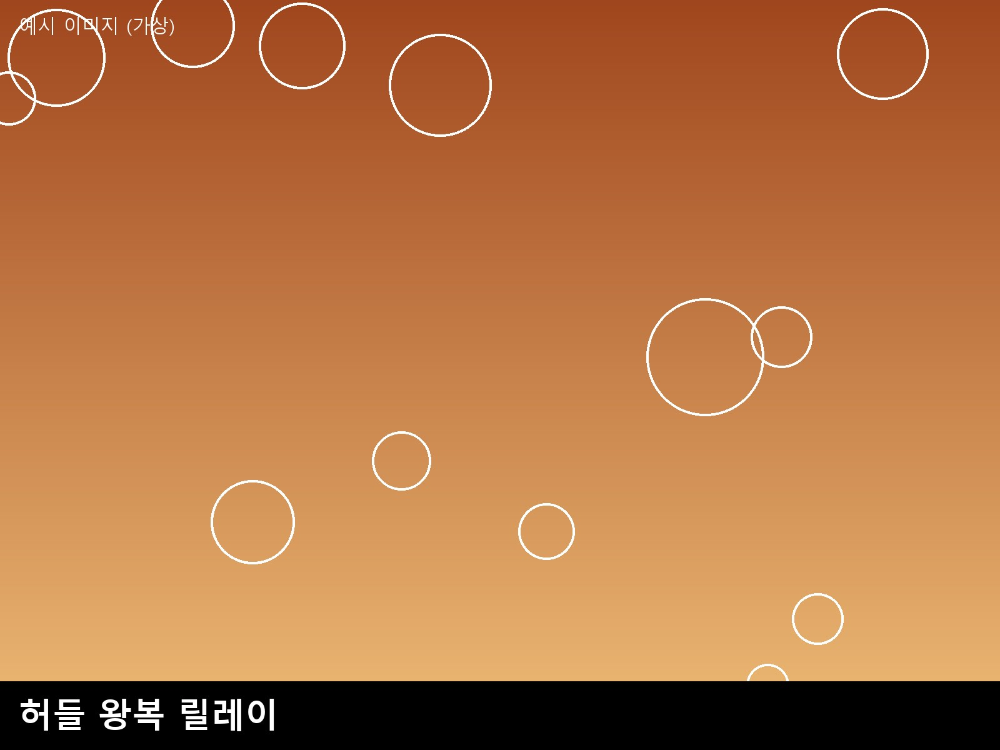
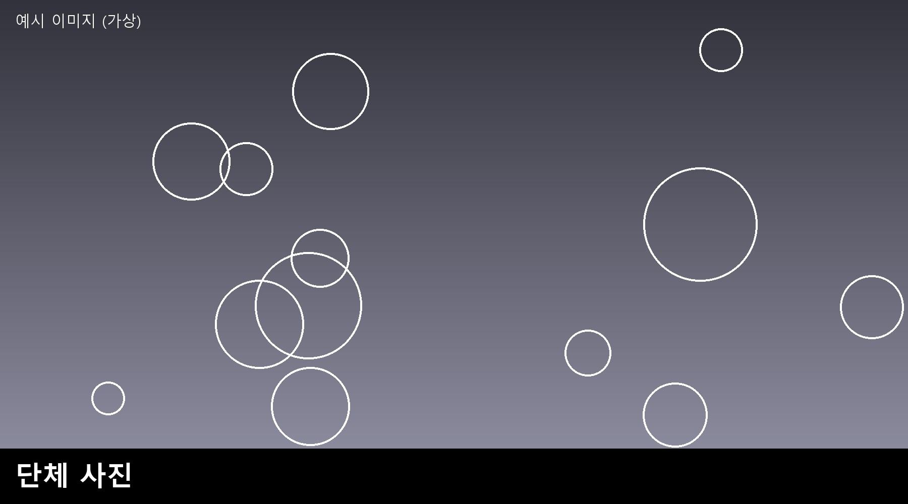

# 2026 ○○ 교원 역량강화 연수 운영 결과 보고
@subtitle ○○교육지원청 ○○과

## Ⅰ. 연수 개요
| 항목 | 내용 |
|:-:|:-:|
| 연수명 | 2026 ○○ 교원 역량강화 연수 |
| 일시 | 1기: 2026. 9. 16.(수) 15:00~17:00 2기: 2026. 9. 22.(화) 15:00~17:00 |
| 장소 | 1기: ○○고 체육관 2기: ○○ 체육관 |
| 대상·인원 | ○○ 관내 초등 교원 기수별 30명 이내(정원 60명) |
| 이수 인원 | 1기 11명, 2기 13명 (총 24명 이수) |
| 만족도 | 전 문항 평균 4.9점 / 5점 (응답 24명) |

:::box 연수 이수교 혜택 이행
이수 교원(24명)이 소속된 학교에 하반기 「○○ 대회」 신청 자격을 부여함.
이수 명단을 대회 신청 자격 확인 자료로 활용할 예정임.
:::

## Ⅱ. 연수 교육과정 운영 결과
<!-- widths: 1.2, 3.3, 3.9, 1.6 -->
| 차시 | 강좌명 | 운영 내용 | 방법 |
|:-:|:-:|:--|:-:|
| 1차시 | 준비운동, 기본 종목 1 | 준비운동 루틴과 기본 종목 지도 방법을 시범·모둠 실습으로 운영 | 실습 |
| 2차시 | 기본 종목 2, 학급 단위 운영 설계 | 심화 종목 실습 후 학급 단위 운영 설계 및 기록지 활용 실습 | 실습·설계 |

## Ⅲ. 기수별 운영 결과
<!-- widths: 1, 2.2, 2.4, 1.8, 1.8, 1, 1 -->
| 기수 | 일시 | 장소 | 주강사 | 보조강사 | 정원 | 이수 |
|:-:|:-:|:-:|:-:|:-:|:-:|:-:|
| 1기 | 2026. 9. 16.(수) 15:00~17:00 | ○○고 체육관 | ○○초 홍길동 | ○○초 김철수 | 30명 | 11명 |
| 2기 | 2026. 9. 22.(화) 15:00~17:00 | ○○ 체육관 | ○○초 홍길동 | ○○초 김철수 | 30명 | 13명 |
| 합계 | 2회 | 2개 장소 |  |  | 60명 | 24명 |

## Ⅳ. 운영 결과
- 실습 중심의 소규모 운영: 기수별 11~13명이 참여하여 강사 1인당 약 6명 수준의 밀착 지도가 이루어짐.
- 이수 관리: 출석 확인과 만족도 조사에 참여한 24명 전원을 이수 처리함.
  - 이수 명단은 대회 신청 자격 확인 자료로 보관함.
- 안전 관리: 준비운동을 전원 함께 실시하여 안전사고 없이 마무리함.

## Ⅴ. 만족도 조사 결과
- 조사 개요: 연수 종료 직후 이수 교원 24명 전원 대상 무기명 설문, 5점 리커트 척도 3문항 및 서술식 의견.
<!-- widths: 5, 1.3, 1.2, 1.2, 1.4, 1.6, 1.1 -->
| 문항 | 매우 만족(5) | 만족 (4) | 보통 (3) | 불만족 (2) | 매우 불만족(1) | 평균 |
|:--|:-:|:-:|:-:|:-:|:-:|:-:|
| 연수 내용이 현장의 필요에 부합하였다 | 23 | 1 | 0 | 0 | 0 | 4.96 |
| 강사의 지도 방법 설명이 명확하였다 | 24 | 0 | 0 | 0 | 0 | 5.00 |
| 전반적 만족도 | 24 | 0 | 0 | 0 | 0 | 5.00 |

<!-- widths: 1, 9.5 -->
| 기수 | 서술식 의견 |
|:-:|:--|
| 1기 | 직접 몸으로 해 보니 아이들에게 어떻게 안내해야 할지 바로 그려졌습니다. |
| 2기 | 학급 단위 운영 설계 시간에 우리 반에 맞춰 계획을 세워 볼 수 있어 실용적이었습니다. |

## Ⅵ. 활동 사진
:::photos columns=3 title="1기 실습 장면"

:::

<!-- widths: 3, 6 -->
| 사진 | 설명 |
|:-:|:--|
|  | 연수 종료 후 만족도 설문에 응답하는 모습(세로 사진은 비율을 유지해 축소됨) |

## Ⅶ. 향후 계획
- 이수 교원 소속 학교를 대상으로 하반기 대회 신청을 안내함.
- 참여 확대를 위해 사전 안내를 강화하고 추가 기수 운영을 검토함.
@end
